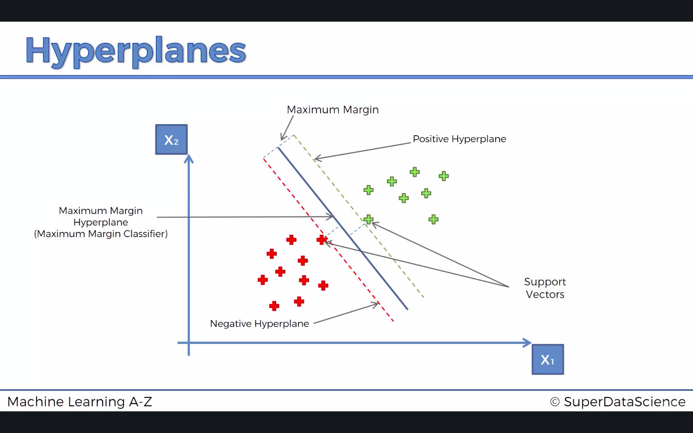
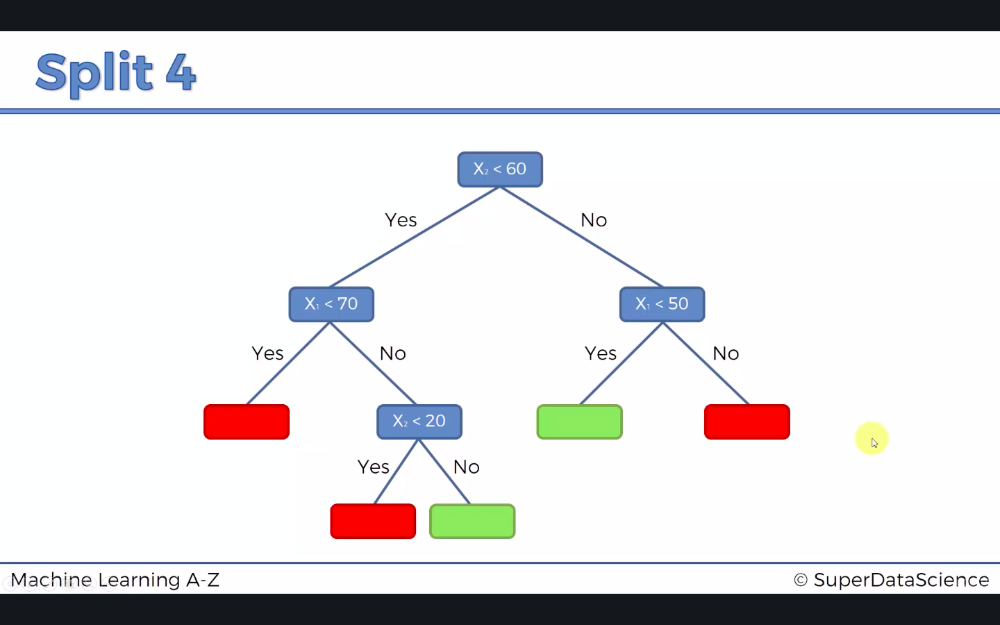
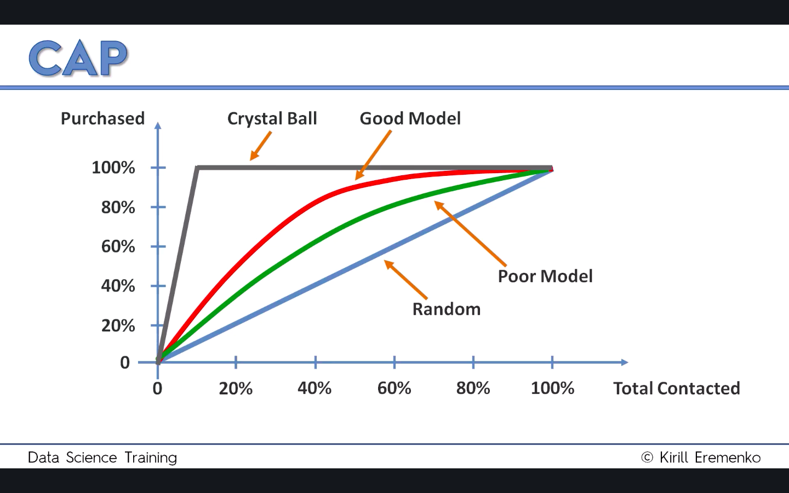

In this case, we only use `Age` and `EstimatedSalary` for independent variables and `Purchased` for dependent variables.

```{r}
# Importing the dataset
dataset = read.csv('Social_Network_Ads.csv')
dataset = dataset[, 3:5]
head(dataset)
```

In some classification models like Naive Bayes, we need to make the dependent variables as `factor`.
```{r}
# Encoding the target feature as factors
dataset$Purchased = factor(dataset$Purchased, levels = c(0, 1))
```

```{r}
# Splitting the dataset into the training and test set
library(caTools)
set.seed(123)
split = sample.split(dataset$Purchased, SplitRatio = 0.75)
training_set = subset(dataset, split == TRUE)
test_set = subset(dataset, split == FALSE)
```

There are two reasons for feature scaling in this case:
- Some models are calculated based on Euclidean distance, which makes feature scaling necessary.
- All visualizations are drawn using $0.01$ resolution, so feature scaling makes graphing more efficient.

```{r}
# Feature scaling
training_set[-3] = scale(training_set[-3])
test_set[-3] = scale(test_set[-3])
```

## 3.1 Logistic Regression
### 3.1.1 Logistic Regression Intuition
The function for simple linear regression is $y=b_0+b_1x$. If we use the sigmoid function to transform this formula to:

$$p=\frac{1}{1+e^{-y}}$$

By using the log scale for both sides, we can get the formula of simple logistic regression:

$$\ln(\frac{p}{1-p})=b_0+b_1x$$

This model can calculate the predicted probability $\hat{p}$ for choosing $y=1$. For every point with the probability below 0.5, we predict it as $0$. Otherwise, we predict it as $1$.

### 3.2 Logistic Regression in R
`family = bionomial` means logistic regression in `glm`.

```{r}
# Fitting logistic regression to the training set
classifier = glm(formula = Purchased ~ ., 
                 family = binomial, 
                 data = training_set)
```

`type = response` will give us the probability in a single vector. `[-3]` means removing the last column.
```{r}
# Predicting the test set results
prob_pred = predict(classifier, type = 'response', newdata = test_set[-3])
y_pred = ifelse(prob_pred > 0.5, 1, 0)
y_pred
```

```{r}
# Making the confusion matrix
cm = table(test_set[, 3], y_pred)
cm
```

```{r}
# Visualizing the training set results
library(ElemStatLearn)
set = training_set
X1 = seq(min(set[, 1]) - 1, max(set[, 1]) + 1, by = 0.01)
X2 = seq(min(set[, 2]) - 1, max(set[, 2]) + 1, by = 0.01)
grid_set = expand.grid(X1, X2)
colnames(grid_set) = c('Age', 'EstimatedSalary')
prob_set = predict(classifier, type = 'response', newdata = grid_set)
y_grid = ifelse(prob_set > 0.5, 1, 0)
plot(set[, -3], 
     main = 'Logistic Regression (Training Set)', 
     xlab = 'Age', ylab = 'Estimated Salary', 
     xlim = range(X1), ylim = range(X2))
contour(X1, X2, matrix(as.numeric(y_grid), length(X1), length(X2)), add = TRUE)
points(grid_set, pch = '.', col = ifelse(y_grid == 1, 'springgreen3', 'tomato'))
points(set, pch = 21, bg = ifelse(set[, 3] == 1, 'green4', 'red3'))
```

```{r}
# Visualizing the test set results
library(ElemStatLearn)
set = test_set
X1 = seq(min(set[, 1]) - 1, max(set[, 1]) + 1, by = 0.01)
X2 = seq(min(set[, 2]) - 1, max(set[, 2]) + 1, by = 0.01)
grid_set = expand.grid(X1, X2)
colnames(grid_set) = c('Age', 'EstimatedSalary')
prob_set = predict(classifier, type = 'response', newdata = grid_set)
y_grid = ifelse(prob_set > 0.5, 1, 0)
plot(set[, -3], 
     main = 'Logistic Regression (Test Set)', 
     xlab = 'Age', ylab = 'Estimated Salary', 
     xlim = range(X1), ylim = range(X2))
contour(X1, X2, matrix(as.numeric(y_grid), length(X1), length(X2)), add = TRUE)
points(grid_set, pch = '.', col = ifelse(y_grid == 1, 'springgreen3', 'tomato'))
points(set, pch = 21, bg = ifelse(set[, 3] == 1, 'green4', 'red3'))
```

The prediction boundary in these two graphs shows that logistic regression is a linear classifier.

## 3.2 K-Nearest Neighbors (K-NN)
### 3.2.1 K-NN Intuition
- **STEP 1**: Choose the number $K$ of neighbors
- **STEP 2**: Take the $K$ nearest neighbors of the new data point, according to the Euclidean distance. For example, for two data point $P_1(x_1, y_1)$ and $P_2(x_2, y_2)$, the Euclidean distance between $P_1$ and $P_2$ is:

$$\text{dist}=\sqrt{(x_2-x_1)^2+(y_2-y_1)^2}$$

- **STEP 3**: Among these $K$ neighbors, count the number of data points in each category. 
- **STEP 4**: Assign the new data point to the category where you counted the most neighbors.

### 3.2.2 K-NN in R
In `knn`, we put fitting and predicting in one line of code. And in this model, we only need independent variables, so we put `[-3]` in the `training_set` and `test_set`. `cl` contains the dependent variable in the training set. `k` means the number of neighbors.

```{r}
# Fitting K-NN to the training set and predicing the test set results
library(class)
y_pred = knn(train = training_set[, -3], 
             test = test_set[, -3], 
             cl = training_set[, 3], 
             k = 5)
y_pred
```

```{r}
# Making the confusion matrix
cm = table(test_set[, 3], y_pred)
cm
```

```{r}
# Visualizing the training set results
library(ElemStatLearn)
set = training_set
X1 = seq(min(set[, 1]) - 1, max(set[, 1]) + 1, by = 0.01)
X2 = seq(min(set[, 2]) - 1, max(set[, 2]) + 1, by = 0.01)
grid_set = expand.grid(X1, X2)
colnames(grid_set) = c('Age', 'EstimatedSalary')
y_grid =knn(train = training_set[, -3], 
              test = grid_set, 
              cl = training_set[, 3], 
              k = 5)
plot(set[, -3], 
     main = 'K-NN (Training Set)', 
     xlab = 'Age', ylab = 'Estimated Salary', 
     xlim = range(X1), ylim = range(X2))
contour(X1, X2, matrix(as.numeric(y_grid), length(X1), length(X2)), add = TRUE)
points(grid_set, pch = '.', col = ifelse(y_grid == 1, 'springgreen3', 'tomato'))
points(set, pch = 21, bg = ifelse(set[, 3] == 1, 'green4', 'red3'))
```

```{r}
# Visualizing the test set results
library(ElemStatLearn)
set = test_set
X1 = seq(min(set[, 1]) - 1, max(set[, 1]) + 1, by = 0.01)
X2 = seq(min(set[, 2]) - 1, max(set[, 2]) + 1, by = 0.01)
grid_set = expand.grid(X1, X2)
colnames(grid_set) = c('Age', 'EstimatedSalary')
y_grid =knn(train = training_set[, -3], 
              test = grid_set, 
              cl = training_set[, 3], 
              k = 5)
plot(set[, -3], 
     main = 'K-NN (Test Set)', 
     xlab = 'Age', ylab = 'Estimated Salary', 
     xlim = range(X1), ylim = range(X2))
contour(X1, X2, matrix(as.numeric(y_grid), length(X1), length(X2)), add = TRUE)
points(grid_set, pch = '.', col = ifelse(y_grid == 1, 'springgreen3', 'tomato'))
points(set, pch = 21, bg = ifelse(set[, 3] == 1, 'green4', 'red3'))
```

The graphs show that K-NN is a nonlinear classifier with a coarse decision boundary.

## 3.3 Support Vector Machine (SVM)
### 3.3.1 SVM Intuition
The SVM find a hyperplane which can maximize the margin between two support vectors. The reason why SVM is so special is that SVM considers the extreme case near to the boundary as the support vector. 



### 3.3.2 SVM in R
In `svm`, we need to specify four parameters in this case:
- `type`: `svm` can be used as a classification machine, as a regression machine, or for novelty detection. Depending of whether `y` is a factor or not, the default setting for type is `C-classification` or `eps-regression`, respectively, but may be overwritten by setting an explicit value.
- `kernel`: Contains `linear`, `polynomial`, `radial basis`, and `sigmoid`.

```{r}
# Fitting SVM to the training set
library(e1071)
classifier = svm(formula = Purchased ~ ., 
                 data = training_set, 
                 type = 'C-classification', 
                 kernel = 'linear')
```

```{r}
# Predicting the test set results
y_pred = predict(classifier, newdata = test_set[-3])
y_pred
```

```{r}
# Making the confusion matrix
cm = table(test_set[, 3], y_pred)
cm
```

```{r}
# Visualizing the training set results
library(ElemStatLearn)
set = training_set
X1 = seq(min(set[, 1]) - 1, max(set[, 1]) + 1, by = 0.01)
X2 = seq(min(set[, 2]) - 1, max(set[, 2]) + 1, by = 0.01)
grid_set = expand.grid(X1, X2)
colnames(grid_set) = c('Age', 'EstimatedSalary')
y_grid = predict(classifier, newdata = grid_set)
plot(set[, -3], 
     main = 'SVM (Training Set)', 
     xlab = 'Age', ylab = 'Estimated Salary', 
     xlim = range(X1), ylim = range(X2))
contour(X1, X2, matrix(as.numeric(y_grid), length(X1), length(X2)), add = TRUE)
points(grid_set, pch = '.', col = ifelse(y_grid == 1, 'springgreen3', 'tomato'))
points(set, pch = 21, bg = ifelse(set[, 3] == 1, 'green4', 'red3'))
```

```{r}
# Visualizing the test set results
library(ElemStatLearn)
set = test_set
X1 = seq(min(set[, 1]) - 1, max(set[, 1]) + 1, by = 0.01)
X2 = seq(min(set[, 2]) - 1, max(set[, 2]) + 1, by = 0.01)
grid_set = expand.grid(X1, X2)
colnames(grid_set) = c('Age', 'EstimatedSalary')
y_grid = predict(classifier, newdata = grid_set)
plot(set[, -3], 
     main = 'SVM (Test Set)', 
     xlab = 'Age', ylab = 'Estimated Salary', 
     xlim = range(X1), ylim = range(X2))
contour(X1, X2, matrix(as.numeric(y_grid), length(X1), length(X2)), add = TRUE)
points(grid_set, pch = '.', col = ifelse(y_grid == 1, 'springgreen3', 'tomato'))
points(set, pch = 21, bg = ifelse(set[, 3] == 1, 'green4', 'red3'))
```

## 3.4 Kernel SVM
### 3.4.1 Kernel SVM Intuition
The assumption for SVM is that the dataset is linearly separable. But when the dataset is nonlinearly separable, we should use the kernel to upgrade the dataset into a higher dimension. We can use a function to project the dataset into a higher dimension, which can make the dataset linearly separable. The problem is mapping to a higher dimensional space can be highly compute-intensive. Thus, we use the kernel trick to deal with this issue.

**The Gaussian RBF Kernel**:

$$K(\vec{x}, \vec{l}^{i})=e^{-\frac{\|\vec{x}-\vec{l}^{i}\|^2}{2\sigma^2}}$$

in three dimensional space, where $\vec{l}$ is the landmark of the center of the curve and $K$ represents the vertical height $\|\vec{x}-\vec{l}^{i}\|$ represents the distance between the center and the point. The point outside the boundary will have a value of $0$, whereas the value inside the boundary will have a value higher than $0$. The bigger $\sigma$ is, the bigger the boundary is.

**Types of Kernel Functions**:
- Gaussian RBF Kernel:

$$K(\vec{x}, \vec{l}^{i})=e^{-\frac{\|\vec{x}-\vec{l}^{i}\|^2}{2\sigma^2}}$$

- Sigmoid Kernel:

$$K(X, Y)=\tanh{(\gamma\cdot X^TY+r)}$$

- Polynomial Kernel:

$$K(X, Y)=(\gamma\cdot X^TY+r)^d, \gamma>0$$

### 3.4.2 Kernel SVM in R
`kernel = "radial"` means Gaussian kernel.
```{r}
# Fitting kernel SVM to the training set
classifier = svm(formula = Purchased ~ ., 
                 data = training_set, 
                 type = 'C-classification', 
                 kernel = 'radial')
```

```{r}
# Predicting the test set results
y_pred = predict(classifier, newdata = test_set[-3])
y_pred
```

```{r}
# Making the confusion matrix
cm = table(test_set[, 3], y_pred)
cm
```

```{r}
# Visualizing the training set results
library(ElemStatLearn)
set = training_set
X1 = seq(min(set[, 1]) - 1, max(set[, 1]) + 1, by = 0.01)
X2 = seq(min(set[, 2]) - 1, max(set[, 2]) + 1, by = 0.01)
grid_set = expand.grid(X1, X2)
colnames(grid_set) = c('Age', 'EstimatedSalary')
y_grid = predict(classifier, newdata = grid_set)
plot(set[, -3], 
     main = 'Kernel SVM (Training Set)', 
     xlab = 'Age', ylab = 'Estimated Salary', 
     xlim = range(X1), ylim = range(X2))
contour(X1, X2, matrix(as.numeric(y_grid), length(X1), length(X2)), add = TRUE)
points(grid_set, pch = '.', col = ifelse(y_grid == 1, 'springgreen3', 'tomato'))
points(set, pch = 21, bg = ifelse(set[, 3] == 1, 'green4', 'red3'))
```

```{r}
# Visualizing the test set results
library(ElemStatLearn)
set = test_set
X1 = seq(min(set[, 1]) - 1, max(set[, 1]) + 1, by = 0.01)
X2 = seq(min(set[, 2]) - 1, max(set[, 2]) + 1, by = 0.01)
grid_set = expand.grid(X1, X2)
colnames(grid_set) = c('Age', 'EstimatedSalary')
y_grid = predict(classifier, newdata = grid_set)
plot(set[, -3], 
     main = 'Kernel SVM (Test Set)', 
     xlab = 'Age', ylab = 'Estimated Salary', 
     xlim = range(X1), ylim = range(X2))
contour(X1, X2, matrix(as.numeric(y_grid), length(X1), length(X2)), add = TRUE)
points(grid_set, pch = '.', col = ifelse(y_grid == 1, 'springgreen3', 'tomato'))
points(set, pch = 21, bg = ifelse(set[, 3] == 1, 'green4', 'red3'))
```

In the graphs above, we get a nonlinear and smooth decision boundary.

## 3.5 Naive Bayes
### 3.5.1 Bayes Theorem

$$P(A|B)=\frac{P(B|A)\cdot P(A)}{P(B)}$$

### 3.5.2 Naive Bayes Classifier
- **STEP 1**: Calculate $P(\text{Walks}|X)$

$$P(\text{Walks}|X)=\frac{P(X|\text{Walks})\cdot P(\text{Walks})}{P(X)}$$

where $P(\text{Walks})$ is the prior probability, $P(X)$ is the marginal likelihood, $P(X|\text{Walks})$ is the likelihood, and $P(\text{Walks}|X)$ is the posterior likelihood. 

$$P(\text{Walks})=\frac{\text{Number of Walkers}}{\text{Total Observations}}$$

$$P(X)=\frac{\text{Number of Similar Observations}}{\text{Total Observations}}$$

$$P(\text{Walks})=\frac{\text{Number of Similar Observations among those who Walk}}{\text{Total Number of Walkers}}$$

- **STEP 2**: Calculate $P(\text{Drives}|X)$

$$P(\text{Drives}|X)=\frac{P(X|\text{Drives})\cdot P(\text{Drives})}{P(X)}$$

where $P(\text{Drives})$ is the prior probability, $P(X)$ is the marginal likelihood, $P(X|\text{Drives})$ is the likelihood, and $P(\text{Drives}|X)$ is the posterior likelihood. 

**Why Naive?**

The Bayes Theorem requires independence between two variables. In this scenario, `Age` and `Salary` must be independent. 

### 3.5.3 Naive Bayes in R
In naive Bayes, we need to encode the dependent variable as factors, just as stated in the previous step.

```{r}
# Fitting naive Bayes to the training set
library(e1071)
classifier = naiveBayes(x = training_set[-3], 
                        y = training_set$Purchased)
```

```{r}
# Predicting the test set results
y_pred = predict(classifier, newdata = test_set[-3])
y_pred
```

```{r}
# Making the confusion matrix
cm = table(test_set[, 3], y_pred)
cm
```

```{r}
# Visualizing the training set results
library(ElemStatLearn)
set = training_set
X1 = seq(min(set[, 1]) - 1, max(set[, 1]) + 1, by = 0.01)
X2 = seq(min(set[, 2]) - 1, max(set[, 2]) + 1, by = 0.01)
grid_set = expand.grid(X1, X2)
colnames(grid_set) = c('Age', 'EstimatedSalary')
y_grid = predict(classifier, newdata = grid_set)
plot(set[, -3], 
     main = 'Naive Bayes (Training Set)', 
     xlab = 'Age', ylab = 'Estimated Salary', 
     xlim = range(X1), ylim = range(X2))
contour(X1, X2, matrix(as.numeric(y_grid), length(X1), length(X2)), add = TRUE)
points(grid_set, pch = '.', col = ifelse(y_grid == 1, 'springgreen3', 'tomato'))
points(set, pch = 21, bg = ifelse(set[, 3] == 1, 'green4', 'red3'))
```

```{r}
# Visualizing the test set results
set = test_set
X1 = seq(min(set[, 1]) - 1, max(set[, 1]) + 1, by = 0.01)
X2 = seq(min(set[, 2]) - 1, max(set[, 2]) + 1, by = 0.01)
grid_set = expand.grid(X1, X2)
colnames(grid_set) = c('Age', 'EstimatedSalary')
y_grid = predict(classifier, newdata = grid_set)
plot(set[, -3], 
     main = 'Naive Bayes (Test Set)', 
     xlab = 'Age', ylab = 'Estimated Salary', 
     xlim = range(X1), ylim = range(X2))
contour(X1, X2, matrix(as.numeric(y_grid), length(X1), length(X2)), add = TRUE)
points(grid_set, pch = '.', col = ifelse(y_grid == 1, 'springgreen3', 'tomato'))
points(set, pch = 21, bg = ifelse(set[, 3] == 1, 'green4', 'red3'))
```

It seems that naive bayes is a nonlinear classifier.

## 3.6 Decision Tree Classification
### 3.6.1 Decision Tree Classification Intuition


### 3.6.1 Decision Tree Classification in R
Decision Tree is not an algorithm based on the Euclidean distance, so we don't need to conduct feature scaling. However, when we do visualization, we need to perform feature scaling to make our algorithm run faster.

```{r}
# Fitting the classifier to the training set
library(rpart)
classifier = rpart(formula = Purchased ~ ., 
                   data = training_set)      
```

`class` means prediciting the class to `y_pred`.
```{r}
# Predicting the test set results
y_pred = predict(classifier, newdata = test_set[-3], type = 'class')
y_pred
```

```{r}
# Visualizing the training set results
library(ElemStatLearn)
set = training_set
X1 = seq(min(set[, 1]) - 1, max(set[, 1]) + 1, by = 0.01)
X2 = seq(min(set[, 2]) - 1, max(set[, 2]) + 1, by = 0.01)
grid_set = expand.grid(X1, X2)
colnames(grid_set) = c('Age', 'EstimatedSalary')
y_grid = predict(classifier, newdata = grid_set, type = 'class')
plot(set[, -3], 
     main = 'Decision Tree (Training Set)', 
     xlab = 'Age', ylab = 'Estimated Salary', 
     xlim = range(X1), ylim = range(X2))
contour(X1, X2, matrix(as.numeric(y_grid), length(X1), length(X2)), add = TRUE)
points(grid_set, pch = '.', col = ifelse(y_grid == 1, 'springgreen3', 'tomato'))
points(set, pch = 21, bg = ifelse(set[, 3] == 1, 'green4', 'red3'))
```

```{r}
# Visualizing the test set results
library(ElemStatLearn)
set = test_set
X1 = seq(min(set[, 1]) - 1, max(set[, 1]) + 1, by = 0.01)
X2 = seq(min(set[, 2]) - 1, max(set[, 2]) + 1, by = 0.01)
grid_set = expand.grid(X1, X2)
colnames(grid_set) = c('Age', 'EstimatedSalary')
y_grid = predict(classifier, newdata = grid_set, type = 'class')
plot(set[, -3], 
     main = 'Decision Tree (Test Set)', 
     xlab = 'Age', ylab = 'Estimated Salary', 
     xlim = range(X1), ylim = range(X2))
contour(X1, X2, matrix(as.numeric(y_grid), length(X1), length(X2)), add = TRUE)
points(grid_set, pch = '.', col = ifelse(y_grid == 1, 'springgreen3', 'tomato'))
points(set, pch = 21, bg = ifelse(set[, 3] == 1, 'green4', 'red3'))
```

We can see that the `rpart` library in `R` has less overfitting than `Python`. 

```{r}
# Plot the decision tree
plot(classifier)
text(classifier)
```

## 3.7 Random Forest Classification
### 3.7.1 Random Forest Classification Intuition
**Ensemble Learning**:

Take multiple machine learning algorithms and put it together to create one bigger machine learning algorithm. 

**How Random Forest Happens**:

- **STEP 1**: Pick at random $K$ data points from the training set.
- **STEP 2**: Build the decision tree associated to these $K$ data points.
- **STEP 3**: Choose the number $Ntree$ of trees you want to build and repeat **STEP 1&2**. 
- **STEP 4**: For a new data point, make each one of your $Ntree$ trees predict the category to which the data points belongs, and assign the new data point to the category that wins the majority vote. 

### 3.7.2 Random Forest Classification in R
In `randomForest`, we need to specify three hyperparameters for this scenario:
- `x, formula`: a data frame or a matrix of predictors, or a formula describing the model to be fitted (for the `print` method, an `randomForest` object).
- `y`: A response vector. If a factor, classification is assumed, otherwise regression is assumed. If omitted, `randomForest` will run in unsupervised mode.
- `ntree`: Number of trees to grow. This should not be set to too small a number, to ensure that every input row gets predicted at least a few times.

```{r}
# Fitting random forest classification to the training set
library(randomForest)
classifier = randomForest(x = training_set[-3], 
                          y = training_set$Purchased, 
                          ntree = 10)
```

```{r}
y_pred = predict(classifier, newdata = test_set[-3])
y_pred
```

```{r}
cm = table(test_set[, 3], y_pred)
cm
```

```{r}
# Visualizing the training set results
library(ElemStatLearn)
set = training_set
X1 = seq(min(set[, 1]) - 1, max(set[, 1]) + 1, by = 0.01)
X2 = seq(min(set[, 2]) - 1, max(set[, 2]) + 1, by = 0.01)
grid_set = expand.grid(X1, X2)
colnames(grid_set) = c('Age', 'EstimatedSalary')
y_grid = predict(classifier, newdata = grid_set, type = 'class')
plot(set[, -3], 
     main = 'Random Forest (Training Set)', 
     xlab = 'Age', ylab = 'Estimated Salary', 
     xlim = range(X1), ylim = range(X2))
contour(X1, X2, matrix(as.numeric(y_grid), length(X1), length(X2)), add = TRUE)
points(grid_set, pch = '.', col = ifelse(y_grid == 1, 'springgreen3', 'tomato'))
points(set, pch = 21, bg = ifelse(set[, 3] == 1, 'green4', 'red3'))
```

```{r}
# Visualizing the test set results
library(ElemStatLearn)
set = test_set
X1 = seq(min(set[, 1]) - 1, max(set[, 1]) + 1, by = 0.01)
X2 = seq(min(set[, 2]) - 1, max(set[, 2]) + 1, by = 0.01)
grid_set = expand.grid(X1, X2)
colnames(grid_set) = c('Age', 'EstimatedSalary')
y_grid = predict(classifier, newdata = grid_set, type = 'class')
plot(set[, -3], 
     main = 'Random Forest (Test Set)', 
     xlab = 'Age', ylab = 'Estimated Salary', 
     xlim = range(X1), ylim = range(X2))
contour(X1, X2, matrix(as.numeric(y_grid), length(X1), length(X2)), add = TRUE)
points(grid_set, pch = '.', col = ifelse(y_grid == 1, 'springgreen3', 'tomato'))
points(set, pch = 21, bg = ifelse(set[, 3] == 1, 'green4', 'red3'))
```

The graphs show some degrees of overfitting for some data points. From all of the results above, the kernel svm might be the best classifier for this case. 

## 3.8 Evaluating Classification Models Performance
### 3.8.1 False Positives & False Negatives
- False Positive: We predict it as a positive outcome but it's false (Type I Error). 
- False Negative: We predict it as a negative outcome but it's false (Type II Error).

In common sense, Type II Error is more dangerous than Type I Error.

### 3.8.2 Confusion Matrix
- True Positive: $\hat{y}=1, y=1$
- True Negative: $\hat{y}=0, y=0$
- False Positive (Type I Error): $\hat{y}=1, y=0$
- False Negative (Type II Error): $\hat{y}=0, y=1$

The more you have in the first diagnal, the better; the more you have in the second diagnal, the worse.

**Calculate two rates**:

$$\text{Accuracy Rate} = \frac{\text{Correct}}{\text{Total}}$$

$$\text{Error Rate} = \frac{\text{Wrong}}{\text{Total}}$$

### 3.8.3 Accuracy Paradox
If we don't choose any models, such as predicting $1$ or $0$ for all, our accuracy may increase compared to using a model. 

### 3.8.4 Cumulative Accuracy Profile (CAP) Curve
Suppose we have $10\%$ customers in the market who will buy the product.


### 3.8.5 CAP Curve Analysis
We draw a $50\%$ line in `total contacted` and we get $x\%$ in `Purchased`. Then we use a rule of thumb:
- If $x<60\%$, then: rubbish
- If $60\%<x<70\%$, then: poor
- If $70\%<x<80\%$, then: good
- If $80\%<x<90\%$, then: very good
- If $90\%<x<100\%$, then: too good (be careful of overfitting)

## 3.9 Conclusion
### 3.9.1 What are the pros and cons of each model ?

### 3.9.2 How do I know which model to choose for my problem ?
Same as for regression models, you first need to figure out whether your problem is linear or non linear. You will learn how to do that in Part 10 - Model Selection. Then:

- If your problem is linear, you should go for Logistic Regression or SVM.

- If your problem is non linear, you should go for K-NN, Naive Bayes, Decision Tree or Random Forest.

Then which one should you choose in each case? You will learn that in Part 10 - Model Selection with k-Fold Cross Validation.

Then from a business point of view, you would rather use:

- Logistic Regression or Naive Bayes when you want to rank your predictions by their probability. For example if you want to rank your customers from the highest probability that they buy a certain product, to the lowest probability. Eventually that allows you to target your marketing campaigns. And of course for this type of business problem, you should use Logistic Regression if your problem is linear, and Naive Bayes if your problem is non linear.

- SVM when you want to predict to which segment your customers belong to. Segments can be any kind of segments, for example some market segments you identified earlier with clustering.

- Decision Tree when you want to have clear interpretation of your model results.

- Random Forest when you are just looking for high performance with less need for interpretation. 

### 3.9.3 How can I improve each of these models?

Same answer as in Part 2: 

In Part 10 - Model Selection, you will find the second section dedicated to Parameter Tuning, that will allow you to improve the performance of your models, by tuning them. You probably already noticed that each model is composed of two types of parameters:

- the parameters that are learnt, for example the coefficients in Linear Regression,
- the hyperparameters.

The hyperparameters are the parameters that are not learnt and that are fixed values inside the model equations. For example, the regularization parameter `lambda` or the penalty parameter `C` are hyperparameters. So far we used the default value of these hyperparameters, and we haven't searched for their optimal value so that your model reaches even higher performance. Finding their optimal value is exactly what Parameter Tuning is about. So for those of you already interested in improving your model performance and doing some parameter tuning, feel free to jump directly to Part 10 - Model Selection.s 
