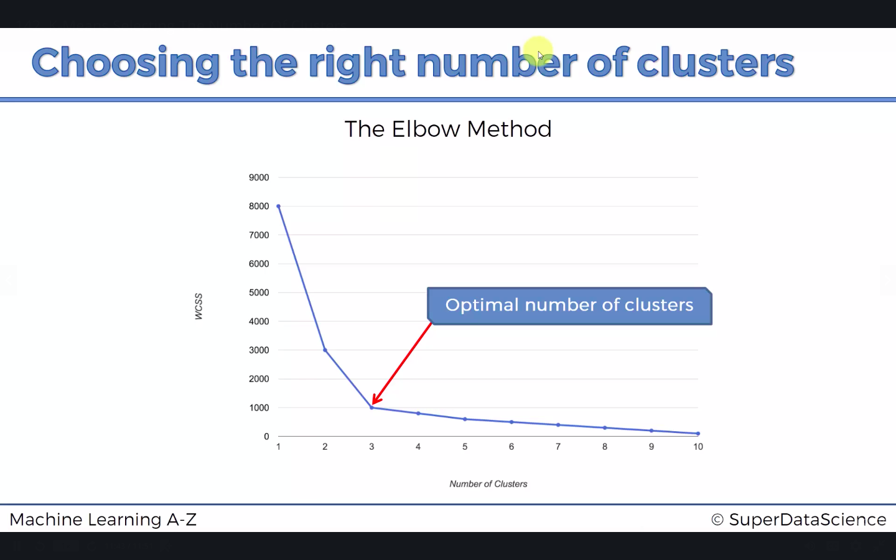
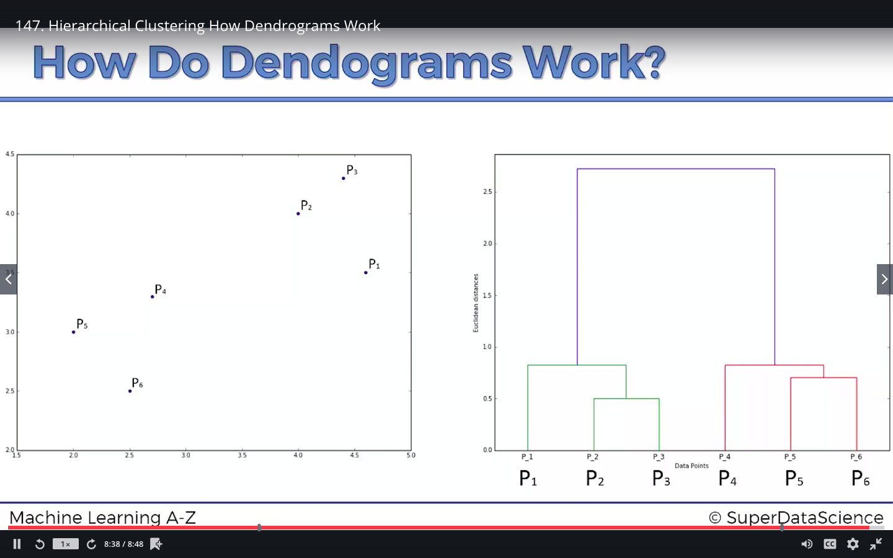

```{r}
# Importing the dataset
dataset = read.csv('Mall_Customers.csv')
head(dataset)
```

```{r}
# Selecting the dataset that we are interested in
X = dataset[4:5]
```

## 4.1 K-Means Clustering
### 4.1.1 K-Means Clustering Intuition
- **STEP 1**: Choose the number $K$ of clusters.
- **STEP 2**: Select at random $K$ points, the centroids (not necessarily from your dataset).
- **STEP 3**: Assign each data point to the closest centroid (that forms $K$ clusters).
- **STEP 4**: Compute and place the new centroid for each cluster.
- **STEP 5**: Reassign each data point to the new closest centroid. If any reassignment took place, go to **STEP 4**, otherwise go to **FIN**. 

**Random Initialization Trap**:

Sometimes the random selected centroid can get the wrong cluster. The solution is to use K-mean++ algorithm. 

**Selecting the Number of Clusters**:

First we need to calculate each $\text{WCSS}$ as the number of clusters increases from $1$:

$$\text{WCSS}=\sum_{j=1}^{K}\sum_{P_i \text{ in Cluster } j}\text{dist}(P_i,C_j)^2$$

Then we depict the curve for each $\text{WCSS}$ and use the elbow method to find the number of clusters.



### 4.1.2 K-Means Clustering in R
In `kmeans`, we need to specify four hyperparameters for this case:
- `x`: numeric matrix of data, or an object that can be coerced to such a matrix (such as a numeric vector or a data frame with all numeric columns).
- `centers`: either the number of clusters, say $k$, or a set of initial (distinct) cluster centres. If a number, a random set of (distinct) rows in x is chosen as the initial centres.
- `iter.max`: the maximum number of iterations allowed.
- `nstart`: if `centers` is a number, how many random sets should be chosen?

Then, we need to use one value:
- `withinss`: Vector of within-cluster sum of squares, one component per cluster.


```{r}
# Using the elbow method to find the optimal number of clusters
set.seed(6)
wcss = vector()
for (i in 1:10) wcss[i] = sum(kmeans(X, i, 300, 10)$withinss)
plot(1:10, wcss, 'b', main = paste('Cluster of Clients'), xlab = 'Number of Clusters', ylab = 'WCSS')
```

The graph shows that the optimal number of clusters is $5$.

```{r}
# Applying k-menas to the dataset
set.seed(29)
kmeans = kmeans(X, 5, iter.max = 300, nstart = 10)
y_means = kmeans$cluster
y_means
```

```{r}
# Visualizng the clusters
library(cluster)
clusplot(X, 
         y_means,
         lines = 0, 
         shade = TRUE, 
         color = TRUE, 
         labels = 2, 
         plotchar = FALSE, 
         span = TRUE, 
         main = paste('Cluster of Clients'), 
         xlab = 'Annual Income',
         ylab = 'Spending Score')
```

## 4.2 Hierachical Clustering (HC)
### 4.2.1 HC Intuition
**Agglomerative HC**:
- **STEP 1**: Make each data point a single-point cluster - That forms $N$ clusters
- **STEP 2**: Take the two closest data points and make them one cluster - That forms $N-1$ clusters
- **STEP 3**: Take the two closest clusters and make them one cluster - That forms $N-2$ clusters
- **STEP 4**: Repeat **STEP 3** until there is only one cluster

**How Do Dendograms Work?**: 



**Using Dendograms**:

A threshold can be set in the dendogram to limit the number of clusters. In order to find the optimal number of clusters, we need to find the longest vertical line which does not cross any extended horizontal line, which indicates the largest distance, and make a threshold across the this line.  

### 4.2.2 HC in R
In `hclust`, we need to specify some hyperparameters for this case:
- `d`: a dissimilarity structure as produced by `dist`.
- `method`: The agglomeration method to be used.

```{r}
# Using the dendrogram to find the optimal number of clusters
dendrogram = hclust(dist(X, method = 'euclidean'), method = 'ward.D')
plot(dendrogram, 
     main = paste('Dendrogram'), 
     xlab = 'Customers', 
     ylab = 'Euclidean Distances')
```

By observing the dendrogram above, we can find the optimal number of clusters is $5$.

In `cutree` method, we need to specify several arguments:
- `tree`: a dendrogram object
- `k`: numeric scalar (OR a vector) with the number of clusters the tree should be cut into.

```{r}
# Fitting HC to the dataset
hc = hclust(dist(X, method = 'euclidean'), method = 'ward.D')
y_hc = cutree(hc, 5)
y_hc
```

```{r}
# Visualizng the clusters
library(cluster)
clusplot(X, 
         y_hc,
         lines = 0, 
         shade = TRUE, 
         color = TRUE, 
         labels = 2, 
         plotchar = FALSE, 
         span = TRUE, 
         main = paste('Cluster of Clients'), 
         xlab = 'Annual Income',
         ylab = 'Spending Score')
```

## 4.3 Conclusion
- K-Means:
    - Pros: Simple to understand, easily adaptable, works well on small or large datasets, fast, efficient and performant
    - Cons: Need to choose the number of clusters
- Hierarchical Clustering:
    - Pros: The optimal number of clusters can be obtained by the model itself, practical visualisation with the dendrogram
    - Cons: Not appropriate for large datasets