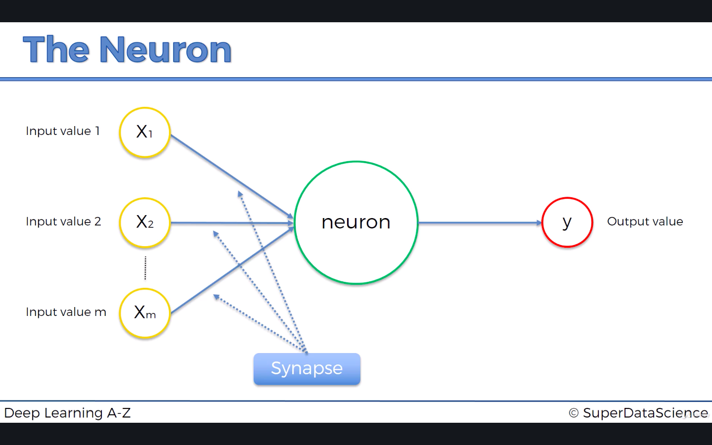

```{r}
# Importing the dataset
dataset = read.csv('Churn_Modelling.csv')
dataset = dataset[4:14]
head(dataset)
```

We don't need to encode `Exited` as factor because the package we use can do this automatically. So what we only need to encode is `Geography` and `Gender` and set the factors as numeric as required by the package. 

```{r}
# Encoding the categorical data as factor
dataset$Geography = as.numeric(factor(dataset$Geography, 
                                      levels = c('France', 'Spain', 'Germany'), 
                                      labels = c(1, 2, 3)))
dataset$Gender = as.numeric(factor(dataset$Gender, 
                                   levels = c('Female', 'Male'), 
                                   labels = c(1, 2)))
```

```{r}
# Splitting the dataset into the training and test set
library(caTools)
set.seed(123)
split = sample.split(dataset$Exited, SplitRatio = 0.8)
training_set = subset(dataset, split == TRUE)
test_set = subset(dataset, split == FALSE)
```

```{r}
# Feature scaling
training_set[-11] = scale(training_set[-11])
test_set[-11] = scale(test_set[-11])
```

## 8.1 Artificial Neural Networks (ANN)
### 8.1.1 The Neuron


**Input Value**:
- The input value contains all of the independent variables (columns) for a single observation.
- It should be standardized.

**Output Value**:
- It can be continuous, binary, and categorical (several output values in the form of dummy variables).

The input and output value deals with one observation at every single time.

**Synapse**: 
- It represents the weight for each signal.

**Neuron**:
- **STEP 1**: Add the weighted sum of all input values $\sum_{i=1}^m w_ix_i$.
- **STEP 2**: Apply the activation function $\phi(\sum_{i=1}^m w_ix_i)$.
- **STEP 3**: Pass the signal to the next neuron.

### 8.1.2 The Activation Function
**Threshold Function**:

$$
\phi(x)=
\begin{cases}
1 \quad & \text{if } x\geq0\\
0 \quad & \text{if } x<0
\end{cases}
$$

**Threshold Function**:
$$
\phi(x)=\frac{1}{1+e^{-x}}
$$

**Rectifier Function**:
$$
\phi(x)=\max(x,0)
$$

**Hyperbolic Tangent (tanh)**:
$$
\phi(x)=\frac{1-e^{-2x}}{1+e^{-2x}}
$$

### 8.1.3 How Do NNs Learn?
- **STEP 1**: Fit the input value of each row into the neural network to compute the output value $\hat{y}$ for each row.
- **STEP 2**: Compare the output value $\hat{y}$ with the actual value $y$ for each row.
- **STEP 3**: Adjust the weights $w_1,w_2,\dots,w_n$.
- **STEP 4**: Do this process again and again in order to find the optimal weights to minimize the cost function.

### 8.1.4 Gradient Descent
- Batch Gradient Descent: Adjust the weights after running all rows.
- Stochastic Gradient Descent: Adjust the weights after running every single row.

Stochastic gradient descent an avoid converging to a local optimum. 

### 8.1.5 Training the ANN with Stochastic Gradient Descent
- **STEP 1**: Randomly initialize the weights to the small numbers close to $0$ (but not $0$).
- **STEP 2**: Input the first observation of your dataset in the input layer, each feature in one input node.
- **STEP 3**: Forward-Propagration: from left to right, the neurons are activated in a way that the impact of each neuron's activation is limited by the weights. Propagate the activations until the predicted result $y$.
- **STEP 4**: Compare the predicted result to the actual result. Measure the generated error.
- **STEP 5**: Forward-Propagration: from right to left, the error is back-propagated. Update the weights according to how much they are responsible for the error. The learning rate decides by how much we update the weights.
- **STEP 6**: Repeat Steps 1 to 5 and update the weights after each observation (reinforcement learning); Repeat Steps 1 to 5 but update the weights only after a batch of observations (batch learning).
- **STEP 7**: When the whole training set passed through the ANN, that makes an epoch. Redo more epochs.

### 8.1.6 ANN in R
In `init` method, we need to specify:
- `nthreads = -1`: Optimize the number of cores used for deep learning

In `deeplearning` method, we need to specify:
- `y`: The name or column index of the response variable in the data.
- `training_frame`: Id of the training data frame.
- `activation`: Activation function.
- `hidden`: Hidden layer sizes.
- `epochs`: How many times the dataset should be iterated (streamed), can be fractional.
- `train_samples_per_iteration`: Number of training samples (globally) per MapReduce iteration, `-2` means automatic.

```{r}
# Fitting the ANN to the training set
library(h2o)
h2o.init(nthreads = -1)
classifier = h2o.deeplearning(y = 'Exited', 
                              training_frame = as.h2o(training_set), 
                              activation = 'Rectifier', 
                              hidden = c(6, 6), 
                              epochs = 100, 
                              train_samples_per_iteration = -2)
```

```{r}
# Predicting the test set results
prob_pred = h2o.predict(classifier, newdata = as.h2o(test_set[-11]))
y_pred = (prob_pred > 0.5)
y_pred = as.vector(y_pred)
y_pred
```

```{r}
# Making the confusion matrix
cm = table(test_set[, 11], y_pred)
cm
```

```{r}
# Disconnecting from the server
h2o.shutdown()
```